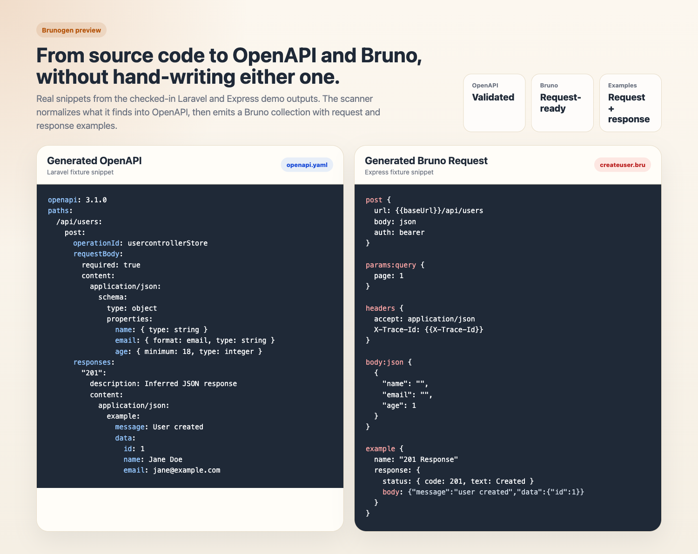

# brunogen

[](https://www.npmjs.com/package/brunogen)
[](https://nodejs.org/)
[](https://github.com/ryan-prayoga/brunogen/actions/workflows/ci.yml)

Brunogen scans a Laravel, Express.js, or Go API codebase, normalizes what it finds into OpenAPI, and emits a Bruno collection you can try immediately.

Brunogen is already useful for real codebases that stay close to common framework conventions. Laravel is the strongest path today, with materially richer request and response inference. Express.js and Go support are available and improving, but still more heuristic.



## What You Get

- `openapi.yaml` generated directly from your routes, handlers, controllers, and request/response patterns
- A ready-to-open Bruno collection under `.brunogen/bruno/`
- Fast feedback on what Brunogen understood well and what it skipped with warnings

## Quick Start

```bash
npm i -g brunogen
brunogen init
brunogen generate
```

Default output:

- `.brunogen/openapi.yaml`
- `.brunogen/bruno/`

## How It Works

```text
source code
  -> framework adapter
  -> normalized endpoint model
  -> openapi.yaml
  -> Bruno collection
```

OpenAPI is the internal source of truth after scanning. Bruno is the output target.

## Works Today

- Global CLI with `init`, `generate`, `watch`, `validate`, and `doctor`
- Laravel route scanning from `routes/*.php`, including groups, prefixes, middleware-based auth hints, and `apiResource` expansion
- Laravel request inference from FormRequest rules, inline validation, and common manual accessors such as `query`, `header`, typed accessors, `has`, `filled`, `safe()->only(...)`, and `enum(...)`
- Laravel response inference for direct arrays, `response()->json(...)`, `noContent()`, same-controller helpers, `JsonResource`, `->additional(...)`, and common abort/error/not-found paths
- Bruno collection generation with environments, baseline bearer/basic/api-key auth support, and native response `example {}` blocks
- OpenAPI generation and validation before export
- Express.js scanning in experimental mode for mounted routers, straightforward request access patterns, and local response helpers
- Go Gin, Fiber, and Echo scanning in experimental mode with stronger direct JSON response inference

For a more detailed per-feature status, see the Support Matrix below.

## Laravel-First Quickstart

The current canonical happy path is the minimal Laravel fixture in `tests/fixtures/laravel`.
Curated generated snapshots for that path live in [docs/demo/laravel-happy-path](docs/demo/laravel-happy-path/README.md).

```bash
cd tests/fixtures/laravel
brunogen init
brunogen generate
```

To refresh the checked-in Laravel demo snapshots after an intentional output change:

```bash
npm run demo:laravel
```

Expected result:

```text
Generated 6 endpoints.
OpenAPI: .../tests/fixtures/laravel/.brunogen/openapi.yaml
Bruno: .../tests/fixtures/laravel/.brunogen/bruno
```

## Express Quickstart

The Express fixture used by the test suite lives in `tests/fixtures/express`.
It covers mounted routers, route chains, middleware-based auth hints, request access patterns, and local response helper inference.
Curated generated snapshots for that path live in [docs/demo/express-happy-path](docs/demo/express-happy-path/README.md).

```bash
cd tests/fixtures/express
brunogen init
brunogen generate
```

Expected result:

```text
Generated 3 endpoints.
OpenAPI: .../tests/fixtures/express/.brunogen/openapi.yaml
Bruno: .../tests/fixtures/express/.brunogen/bruno
```

## Go Quickstart

The Go fixtures used by the test suite live in `tests/fixtures/gin`, `tests/fixtures/fiber`, and `tests/fixtures/echo`.
The Gin fixture is the simplest place to try the current Go adapter behavior end to end.

```bash
cd tests/fixtures/gin
brunogen init
brunogen generate
```

Expected result:

```text
Generated 2 endpoints.
OpenAPI: .../tests/fixtures/gin/.brunogen/openapi.yaml
Bruno: .../tests/fixtures/gin/.brunogen/bruno
```

Go support is still experimental, so prefer Laravel or Express if you want the most complete inference today.

If you are testing from this repository checkout instead of an installed package, run `npm install`, `npm run build`, and `npm link` once from the repository root first.

## Supported Patterns

These are the current code shapes Brunogen reads most reliably.

### Laravel

Request inference is strongest when controllers or FormRequest classes use patterns like:

```php
$request->validate([...]);
$request->string('device_name');
$request->boolean('remember_me');
$request->array('scopes');
$request->query('page');
$request->header('TTOKEN');
$request->has('profile_photo');
$request->filled('nickname');
$request->safe()->only(['locale']);
$request->enum('role', UserRole::class);
```

Response inference is strongest when controllers use patterns like:

```php
return response()->json([...], 201);
return [...];
return ProjectResource::make($project)->additional([...]);
return $this->createdResponse($payload);
abort_if(!$enabled, 403, 'Forbidden');
Model::query()->findOrFail($id);
throw ValidationException::withMessages([...]);
```

### Express

Request inference is strongest when handlers use patterns like:

```ts
const { name, email, age = 18 } = req.body;
const page = req.query.page;
const { page: currentPage = 1 } = req.query;
const traceId = req.get("X-Trace-Id");
const auth = req.headers.authorization;
const trace = req.headers["x-trace-id"];
```

Response inference is strongest when handlers use patterns like:

```ts
return res.status(201).json({ message: "created", data: payload });
return res.json({ data: { id, name } });
return res.send("ok");
return res.sendStatus(204);
return sendCreated(res, payload);
return responseHelpers.sendCreated(res, payload);
```

### Go

Request inference is strongest when handlers use patterns like:

```go
var req CreateUserRequest
if err := c.ShouldBindJSON(&req); err != nil { return }
if err := ctx.Bind(&req); err != nil { return err }
page := c.Query("page")
id := c.Param("id")
token := c.Get("TTOKEN")
```

Response inference is strongest when handlers use patterns like:

```go
c.JSON(http.StatusCreated, gin.H{"message": "created", "data": req})
return ctx.JSON(http.StatusOK, map[string]any{"data": payload})
return fiberHelper(c, payload)
```

## Example Input Project Shape

This is the minimal Laravel shape Brunogen currently handles well:

```text
app/
  Http/
    Controllers/
      SessionController.php
      UserController.php
    Requests/
      StoreUserRequest.php
routes/
  api.php
artisan
composer.json
```

## Example Output Tree

Generated from the Laravel fixture:

```text
.brunogen/
  openapi.yaml
  bruno/
    bruno.json
    environments/
      local.bru
    session/
      sessioncontrollercheck.bru
      sessioncontrollerstore.bru
    user/
      usercontrollerindex.bru
      usercontrollerindexgetapiprojects.bru
      usercontrollershow.bru
      usercontrollerstore.bru
```

The same snapshot is also checked into:

- [output-tree.txt](docs/demo/laravel-happy-path/output-tree.txt)
- [openapi-snippet.yaml](docs/demo/laravel-happy-path/openapi-snippet.yaml)
- [sessioncontrollercheck.bru](docs/demo/laravel-happy-path/bruno/session/sessioncontrollercheck.bru)
- [usercontrollerstore.bru](docs/demo/laravel-happy-path/bruno/user/usercontrollerstore.bru)

## Example Generated OpenAPI

Real snippet from the generated Laravel fixture output:

```yaml
openapi: 3.1.0
paths:
  /api/users:
    post:
      operationId: usercontrollerStore
      summary: UserController::store
      tags:
        - User
      requestBody:
        required: true
        content:
          application/json:
            schema:
              type: object
              properties:
                name:
                  maxLength: 255
                  type: string
                email:
                  format: email
                  type: string
                age:
                  nullable: true
                  minimum: 18
                  type: integer
              required:
                - name
                - email
      responses:
        "201":
          description: Inferred JSON response
          content:
            application/json:
              schema:
                type: object
                properties:
                  message:
                    type: string
                  data:
                    type: object
                    properties:
                      id:
                        type: integer
                      name:
                        type: string
                      email:
                        type: string
              example:
                message: User created
                data:
                  id: 1
                  name: Jane Doe
                  email: jane@example.com
      security:
        - bearerAuth: []
```

## Example Generated Bruno Request

Real snippet from the generated Laravel fixture output:

```bru
meta {
  name: usercontrollerStore
  type: http
  seq: 4
  tags: [
    User
  ]
}

post {
  url: {{baseUrl}}/api/users
  body: json
  auth: bearer
}

headers {
  accept: application/json
  content-type: application/json
}

auth:bearer {
  token: {{authToken}}
}

body:json {
  {
    "name": "",
    "email": "user@example.com",
    "age": 1
  }
}

example {
  name: "201 Response"
  description: "Inferred JSON response"

  request: {
    url: {{baseUrl}}/api/users
    method: post
    mode: json
    headers: {
      accept: application/json
      content-type: application/json
    }

    body:json: {
      {
        "name": "",
        "email": "user@example.com",
        "age": 1
      }
    }
  }

  response: {
    headers: {
      Content-Type: application/json
    }

    status: {
      code: 201
      text: Created
    }

    body: {
      type: json
      content: '''
        {
          "message": "User created",
          "data": {
            "id": 1,
            "name": "Jane Doe",
            "email": "jane@example.com"
          }
        }
      '''
    }
  }
}
```

## Example Config

```json
{
  "version": 1,
  "framework": "auto",
  "inputRoot": ".",
  "output": {
    "openapiFile": ".brunogen/openapi.yaml",
    "brunoDir": ".brunogen/bruno"
  },
  "project": {
    "version": "1.0.0",
    "serverUrl": "{{baseUrl}}"
  },
  "environments": [
    {
      "name": "local",
      "variables": {
        "baseUrl": "http://localhost:3000",
        "authToken": ""
      }
    },
    {
      "name": "prod",
      "variables": {
        "baseUrl": "https://api.example.com",
        "authToken": ""
      }
    }
  ],
  "auth": {
    "default": "auto",
    "bearerTokenVar": "authToken",
    "basicUsernameVar": "username",
    "basicPasswordVar": "password",
    "apiKeyVar": "apiKey",
    "apiKeyName": "X-API-Key",
    "apiKeyLocation": "header"
  }
}
```

## Support Matrix

| Area | Status | Notes |
| --- | --- | --- |
| Laravel route scanning | Supported | Reads `routes/*.php` declarations |
| Laravel route groups and prefixes | Supported | Handles common `prefix`, `middleware`, and grouped routes |
| Laravel `apiResource` expansion | Supported | Common REST actions are expanded |
| Laravel FormRequest inference | Partial | `rules()` arrays are supported; complex dynamic rules are not |
| Laravel manual request inference | Strong partial | Common `query`, `header`, `input`, typed accessors, `has`, `filled`, `only([...])`, `safe()->only([...])`, and `enum(...)` patterns are inferred |
| Laravel inline validation inference | Partial | Simple `$request->validate()` and `Validator::make()` arrays |
| Auth inference | Partial | Middleware and OpenAPI security are inferred heuristically |
| OpenAPI generation | Supported | OpenAPI is the normalized intermediate output |
| Bruno export | Supported | Collection, requests, environments, baseline auth blocks, and response `example {}` blocks |
| Express route scanning | Experimental | Handles `express()` / `Router()`, `use()` mounts, and `route()` chains |
| Express handler inference | Experimental | Heuristic request and response inference from straightforward handlers and local response helpers |
| Go Fiber scanning | Experimental | Route and request inference are heuristic |
| Go Gin scanning | Experimental | Route and request inference are heuristic |
| Go Echo scanning | Experimental | Route and request inference are heuristic |
| Go request schema inference | Experimental | Works for straightforward bind/body-parser patterns |
| Laravel response inference | Strong partial | Covers direct arrays, `response()->json(...)`, `noContent()`, same-controller wrapper helpers, `JsonResource`, `->additional(...)`, and common abort/error/not-found paths |
| Express response inference | Partial | Straightforward `res.json()`, `res.send()`, `res.status(...).json()`, `sendStatus()`, and local helper wrappers |
| Go response inference | Partial | Covers common direct JSON responses plus existing helper-based patterns, but remains heuristic |
| Watch mode | Supported | Regenerates on `.php`, `.go`, `.js`, `.cjs`, `.mjs`, and `.ts` changes |

## Known Limitations

- Brunogen is optimized for conventional code, not heavily dynamic or meta-programmed applications.
- Laravel and Express parsing are regex-driven rather than full AST analysis, so unusual declarations can still be missed.
- Complex route factories, indirect exports, custom router abstractions, and highly dynamic middleware composition may be skipped with warnings.
- Complex Laravel validation rules, custom rule objects, and conditional validation are only partially inferred.
- Laravel response inference is strongest for controller-local patterns and common resource usage; cross-class service wrappers and highly dynamic composition are still best-effort.
- Express request and response inference is strongest for direct `req.body` / `req.query` / `req.headers` access and local `res.*()` helper wrappers.
- Go support is still experimental, especially around indirect helpers, nested wrappers, and custom response builders.
- Generated Bruno auth gives you a usable starting point, not a complete auth flow engine.

## Roadmap

- Keep Laravel as the most reliable path and harden it around the patterns teams use most in real controllers
- Push Express closer to Laravel in day-to-day usefulness without losing the current lightweight scanner model
- Improve response inference across Laravel and Go while keeping OpenAPI as the stable internal contract
- Broaden support for reusable wrappers and helper-driven response patterns where the code is still statically readable
- Reduce false positives and make supported code patterns more explicit in docs and fixtures
- Add more canonical fixtures and checked-in demos before broadening framework claims further

## Project Docs

- [CHANGELOG.md](CHANGELOG.md)
- [CONTRIBUTING.md](CONTRIBUTING.md)
- [docs/release-checklist.md](docs/release-checklist.md)
